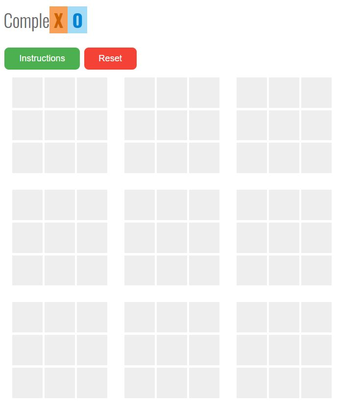
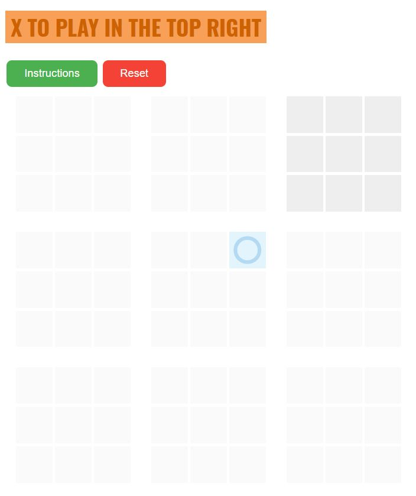

# CompleXO-JS
An ingenious twist to the all time favorite XO or Cross and Noughts in JavaScript.
Grab a friend and check out the game at [dssr2.github.io/complexo.html](https://dssr2.github.io/complexo.html "CompleXO")
# How to Play
1. The game board is divided into a large 3\*3 grid with each cell containing a smaller 3\*3 grid. 

2. The aim of the game is to get a line, vertical horizontal or diagonal in the large grid. 
3. To claim a large grid as either X or O, the player must win within the grid. 
4. Based on where a player plays in the small grid, the opponent must play in that corresponding location in the big grid. For example, in the image below, O played in the top right corner of the centre large grid. Therefore, X must now make a move anywhere in the top right large grid.  

5. O begins the game. 